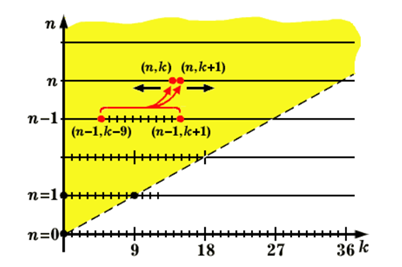

# Lucky_tickets
Solving the problem of finding the number of lucky tickets of length $N$

## Постановка задачи
Билет, состоящий из $N$ десятичных знаков, считается счастливым, если сумма первых $N/2$ цифр равна сумме последних $N/2$ цифр ($N$ – четное). Требуется написать программу, вычисляющую число счастливых билетов по заданной длине билета, определить максимальное $N$, для которого программа находит ответ не более чем за минуту.

## Описание используемого алгоритма
Обозначим через $A_n\left(k\right)$ количество $n$-значных чисел $\left(n=1,\ 2\ ,\ 3\ ,\cdots\right)$, сумма цифр каждого из которых равна $k$. Для заданного $n$ будем иметь $9\ast n+1$ различных значений этих сумм, принимающих значения от $0$ до $9\ast n$, тогда $A_n\left(k\right)=0$ при $k<0$ и $k>9\ast n$. Также очевидно, что $A_n\left(0\right)=1$. Чтобы получить счастливый билет с суммой первых $n$ и $n$ последних цифр, равной $k$, можно выбрать любой из $A_n\left(k\right)$ этих $n$-значных  номеров для левой половины номера билета и любой другой (или тот же самый) — для правой. Следовательно, в общем же случае счастливых билетов, с суммой цифр в каждой «половинке» равной $k$, будет $\left[A_n\left(k\right)\right]^2$. Таким образом, чтобы узнать число счастливых билетов длинны $2\ast n$ необходимо просуммировать $\left[A_n\left(k\right)\right]^2$ по всем возможным $k$.

Так как $n$-значное число с суммой цифр $k$ получается из $(n-1)$-значного  числа с суммой цифр $l$ (где $k-9\le l\le k$) добавлением цифры $k-l$ можно написать:

$$
A_n(k) = \sum\limits_{l=k-9}^{k} A_{n-1}(l)
$$

Подставив в это соотношение $k+1$ вместо $k$, получим рекуррентную формулу:

$$
A_n(k+1) = A_n(k) +A_{n-1}(k+1) - A_{n-1}(k-9)
$$

Для $A_1\left(k\right)$ нужно определить, сколько однозначных чисел имеет сумму цифр $k$. Но для однозначного числа сумма цифр совпадает с самим числом. Есть одно однозначное число с суммой цифр, равной нулю, — это $0$; одно однозначное число с суммой цифр, равной единице, — это $1$, одно число с суммой цифр, равной двум, — $2$, и т.д. Значит $A_1\left(k\right)=1$ для $k$ от $0$ до $9$ и равно $0$ для других значений $k$.

Алгоритм будет рекуррентно вычислять массивы значений $A_n\left(k\right)$ для $n=1,\ 2,\ 3,\cdots,\ N/2$, а затем суммировать квадраты значений $A_{N/2}\left(k\right)$ по всем возможным $k$.

Заметим также, что значения $A_n\left(k\right)$ симметричны, то есть $A_n\left(k\right)=A_n\left(9\ast n-k\right)$, поэтому мы можем вычислять только первую “половину” массива значений $A_n\left(k\right)$, а вторую “половину” получать уже без вычислений, просто присвоением значений.

## Оценка сложности алгоритма
Вычисление  $A_n\left(k+1\right)$ по рекуррентной формуле требует $2$ аддитивных операций, то есть выполняется за константу. Но нам нужно совершить $9\ast n$ таких вычислений, значит переход от $n-1$ к $n$ числу требует $O\left(n\right)$ операций. Также, чтобы посчитать значения $A_n\left(k\right)$ нам необходимо совершить $n-1$ переход: от значений $A_1\left(k\right)$ к $A_2\left(k\right)$, от значений $A_2\left(k\right)$ к $A_3\left(k\right)$, $\dots$, от значений $A_{n-1}\left(k\right)$ к $A_n\left(k\right)$. Плюс в конце суммирование и возведение в квадрат для вычисления ответа займет $O\left(n\right)$ операций. В результате получаем оценку в $O\left(n^2\right)$ операций, что эквивалентно $O\left(N^2\right)$ операциям. Таким образом сложность алгоритма - $O\left(N^2\right)$.

## Результаты вычислений
#### Описание компьютерной платформы 
- Процессор – AMD Ryzen 7 5600H, ядра: 6 * 3.3 Ггц
- Объем оперативной памяти 16 ГБ
- Операционная система – Windows 11

#### Результаты
- Максимальное N равно 10380
- Время работы алгоритма для N = 6, 20, 50 составляет меньше микросекунды
- Время работы программы для N = 648 равно 51.998 миллисекунд
- Число счастливых билетов для N=6, 20, 50, 648 соответственно:
  - 55252
  - 3081918923741896840
  - 1958235988893910037740658552689739094876481545140
  - 5454978000607710670631506075715582236583264919494546492727460149540044531481401014159684327716717990092610435486672576779950952057563864578487670206880668745915946844341540150854810786821541405606311909635748331659088894661537020600686699469017564417597574879407835603302994554810592694803938192957643007654401998902256744362798766202540400602686164980365648468365590863380413805510851383175701921452589707244321316899384545716158522011760126088155590904014092061879796115118192767629939637598982863006775373439560988111001145271134045974282698334910199284620568700863121849695683242572974775360133557958217733670352292908804125989028395612002000
